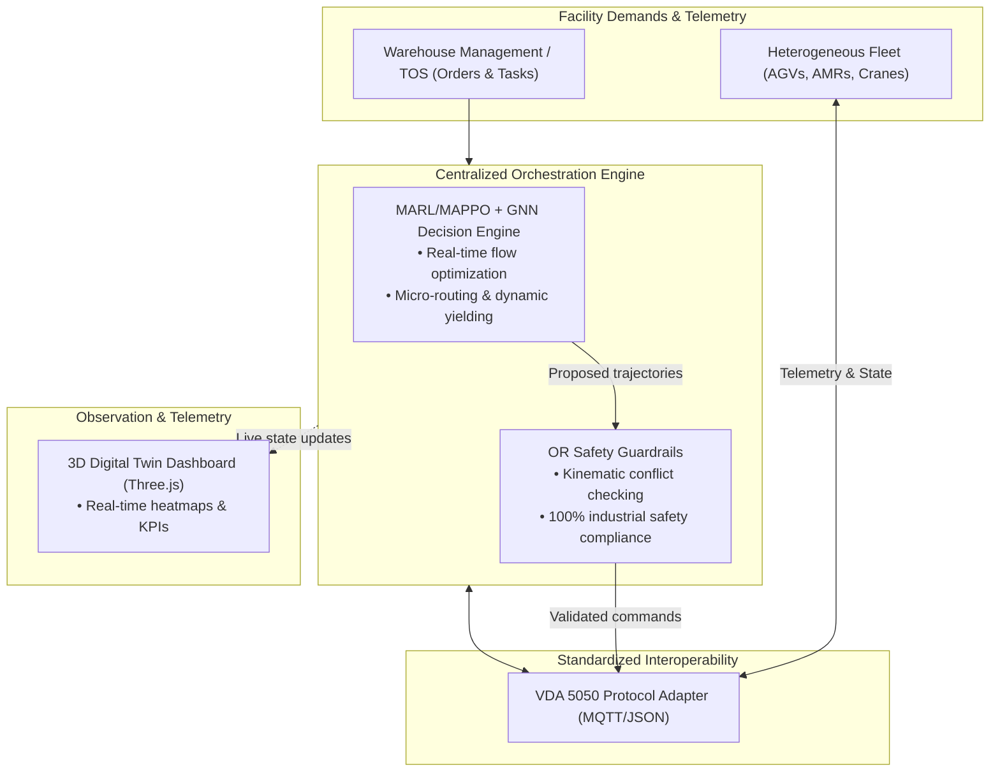

# Smart Logistics & Fleet Coordination Platform

Industrial-grade hardware-agnostic orchestration platform for optimizing autonomous fleets in logistics hubs using hybrid MARL + OR safety guardrails.

## Install

```bash
python3 -m pip install ".[dev]"
```

## Core Features

- **Hybrid AI Architecture**: Real-time Multi-Agent PPO (MAPPO) decisions augmented with deterministic OR safety guardrails
- **VDA 5050 Interoperability**: Standardized MQTT/JSON protocol for mixed fleet control
- **Digital Twin Visualization**: Real-time Three.js dashboard for facility monitoring
- **Zero-Deadlock Guarantees**: Formal safety verification at all planning layers
- **Scalable Simulation**: High-performance port and warehouse simulation environments

## Quick Start

### 1. Basic Simulation Loop
```python
from port_sim import PortEnv, default_config

env = PortEnv(default_config())
obs, info = env.reset(seed=7)

done = False
while not done:
    action = env.action_space.sample()
    obs, reward, terminated, truncated, info = env.step(action)
    done = terminated or truncated
```

Run with:
```bash
python3 examples/random_agent.py
```

### 2. Heuristic Agent Visualization
```bash
python3 examples/heuristic_agent_trace.py
```

### 3. Digital Twin Web Interface
```bash
python3 examples/ui_server.py
```

Open browser at `http://127.0.0.1:8000` for real-time 3D facility visualization. The UI includes local Three.js vendor files under `examples/ui/vendor`, requiring no CDN dependencies.

## Architecture Overview


## Key Performance Indicators

| Category | Metric | Target | Validation Method |
|----------|--------|--------|-------------------|
| **Throughput** | Container Moves/Hour | +15% to +25% | Discrete simulator |
| **Fleet Efficiency** | Deadheading Reduction | 15% - 20% | Distance metrics |
| **Stability** | Intersection Deadlocks | Zero | Synthetic stress tests |
| **Latency** | Action Inference | ≤15ms | Benchmark telemetry |

## Running Tests
```bash
pytest
```

## Documentation
- [System Architecture Overview](docs/OVERVIEW.md)
- [Digital Twin Implementation Guide](docs/phases/02_UI_DIGITAL_TWIN.md)
- [Simulation Environment Specifications](src/port_sim/README.md)
- [Experiment Results & Benchmarks](docs/experiments/)