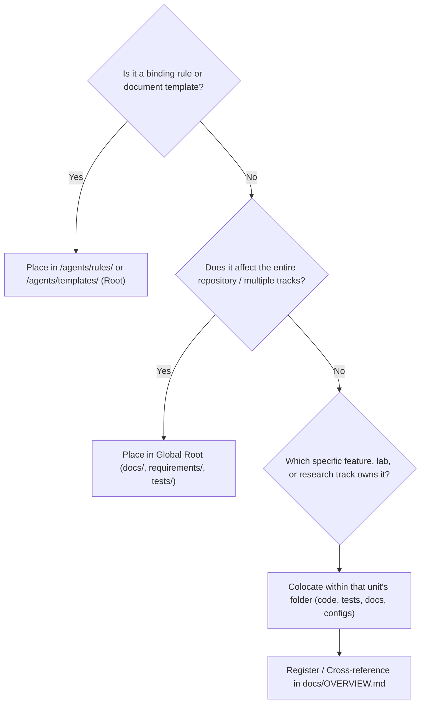

# FOLDER_STRUCTURE.md — Repository Directory Layout & Organizational Principles

- **Motivation/Background**: Deep learning projects vary widely in scale — from focused single-track investigations to large multi-lab coursework or multi-track research suites. Forcing every project into one rigid global folder layout causes either confusion for small projects or massive scattering and namespace collisions for modular projects.
- **Purpose**: Establish clear architectural principles, boundaries, and decision rules governing what must be global/shared versus what should be colocated within self-contained features, labs, or research units, while ensuring constitutional governance (`/agents`) remains permanently discoverable at the repository root.
- **Overview Pipeline**: Derived from lessons learned during the 3-lab coursework consolidation and codified as an immutable governance rule.
- **Detailed Plan**: §1 Constitutional Core & Governance Discoverability; §2 Dual-Paradigm Archetypes (Single-Track vs Multi-Track); §3 Global vs. Colocated Classification Matrix; §4 Agent Decision Rules for Artifact Placement; §5 Runtime Output Namespacing & Sentinel Rules; §6 Audit & Enforcement Protocol.
- **References**: `agents/rules/CODEBASE_AUDIT.md`, `agents/rules/LOGGING_CHECKPOINT_RULES.md`, `docs/README.md`.
- **Created**: 2026-07-25T00:00:00+07:00
- **Last Updated**: 2026-09-06T21:15:00+07:00

---

## Table of Contents

- [1. Constitutional Core &amp; Governance Discoverability](#1-constitutional-core--governance-discoverability)
- [2. Dual-Paradigm Archetypes](#2-dual-paradigm-archetypes)
  - [Archetype A: Single-Track / Monolithic Layout](#archetype-a-single-track--monolithic-layout-small--focused-projects)
  - [Archetype B: Multi-Track / Feature-Modular Layout](#archetype-b-multi-track--feature-modular-layout-multi-lab--multi-feature)
- [3. Global vs. Colocated Classification Matrix](#3-global-vs-colocated-classification-matrix)
- [4. Agent Decision Rules for Artifact Placement](#4-agent-decision-rules-for-artifact-placement)
- [5. Runtime Output Namespacing &amp; Sentinel Rules](#5-runtime-output-namespacing--sentinel-rules)
- [6. Audit &amp; Enforcement Protocol](#6-audit--enforcement-protocol)

---

## 1. Constitutional Core & Governance Discoverability

Regardless of project scale or track topology, the root **`/agents`** directory is the immutable constitutional anchor of the entire repository:

1. **Always at Repository Root:** AI agents land at the workspace root. `/agents` MUST reside at the top level so that any agent, tool, or human engineer immediately discovers the binding rules and templates upon arrival.
2. **Never Duplicated Across Features:** Never create nested `feature_a/agents/` or `lab1/agents/`. Governance is unified and repository-wide.
3. **Strict Content Isolation:** `/agents` contains ONLY immutable rules (`agents/rules/`), document templates (`agents/templates/`), and the agent entry point (`agents/README.md`). All evolving project notes, plans, and reports live outside `/agents`.

---

## 2. Dual-Paradigm Archetypes

The template officially supports two organizational paradigms based on project complexity:

### Archetype A: Single-Track / Monolithic Layout (Small / Focused Projects)

Best for: Single research papers, standalone model exploration, or a cohesive single-task pipeline.

```text
project_root/
├── agents/                                # Universal governance (immutable rules & templates)
│   ├── rules/
│   └── templates/
├── docs/                                  # Global project documentation
│   ├── README.md                          # Master index
│   ├── PURPOSE.md                         # Project brief & locked objective
│   ├── OVERVIEW.md                        # Living roadmap
│   ├── shared/                            # Universal SOPs & handoffs
│   ├── phases/                            # Phase specifications (01_DATA_PREP.md, etc.)
│   ├── progress/                          # Live session trackers (*_STATUS.md)
│   ├── experiments/                       # Experiment writeups & hypotheses
│   ├── bugs/                              # Bug diagnoses & regression tests
│   └── references/                        # Reusable guides (Git, Optuna, etc.)
├── src/                                   # Maintainable Python package (flat layers)
│   ├── data/
│   ├── models/
│   ├── training/
│   ├── eval/
│   ├── experiments/
│   └── utils/
├── configs/                               # Centralized YAML configurations
├── data/                                  # raw/ (immutable) & processed/
├── experiments/                           # Runtime artifacts: runs/ (checkpoints) & results/
├── notebooks/                             # Exploratory demos & analysis only (NO training)
├── requirements/                          # Multi-tier dependency specs (base.txt, dev.txt)
├── requirements.txt                       # Proxy referencing requirements/dev.txt
├── pyproject.toml                         # Packaging and tool configs
└── tests/                                 # Centralized unit and smoke test suite
```

---

### Archetype B: Multi-Track / Feature-Modular Layout (Multi-Lab / Multi-Feature)

Best for: Multi-lab coursework (e.g. LAB1, LAB2, LAB3), research suites evaluating multiple independent domains (e.g. CV vs NLP vs RL), or systems with self-contained feature tracks.

In this archetype, work is naturally partitioned into self-contained units (e.g., `features/<name>/`, `tracks/<name>/`, `labs/<name>/`, or namespaced packages `src/<name>/`). Related code, tests, and documentation are **colocated within that unit** to prevent scattering across unrelated global directories:

```text
project_root/
├── agents/                                # GLOBAL: Single constitutional anchor (rules & templates)
├── docs/                                  # GLOBAL: Cross-cutting project overview & shared SOPs
│   ├── README.md                          # Master index linking all tracks
│   ├── PURPOSE.md                         # Overarching repository mission
│   ├── OVERVIEW.md                        # Central roadmap indexing all tracks/features
│   └── shared/                            # Universal SOPs (HOW_TO_SETUP, HANDOFF, ML_PIPELINE)
│
├── requirements/                          # GLOBAL: Shared dependency tiers
│   ├── base.txt                           # Universal core (numpy, torch, etc.)
│   ├── track1.txt                         # Track 1 specific packages (e.g. torchvision)
│   ├── track2.txt                         # Track 2 specific packages (e.g. transformers, peft)
│   └── dev.txt                            # Unified test/lint suite
│
├── tracks/ (or features/ or labs/ or src/)
│   ├── track_alpha/                       # Self-contained research or feature unit
│   │   ├── code/ (or src/)                # Track-specific models, datasets, & training scripts
│   │   ├── tests/                         # Track-specific test battery
│   │   ├── configs/                       # Track-specific hyperparameters & configs
│   │   ├── docs/                          # Track-specific specs (phases, hypotheses, bugs)
│   │   │   ├── phases/
│   │   │   ├── experiments/
│   │   │   └── bugs/
│   │   └── experiments/                   # Track runtime outputs: runs/ & results/
│   │
│   └── track_beta/                        # Independent second feature or lab track
│       ├── code/
│       ├── tests/
│       ├── configs/
│       ├── docs/
│       └── experiments/
│
├── pyproject.toml                         # Unified packaging discoverable across all tracks
└── tests/                                 # Global cross-cutting integration & smoke tests
```

> [!TIP]
> Both paradigms preserve the same core contract: **Constitutional `/agents` at root, script-driven training, full-state checkpoints, and verifiable tests.**

---

## 3. Global vs. Colocated Classification Matrix

| Artifact Type                              | Scope               | Canonical Placement                                                                             | Architectural Rationale                                                                                                       |
| :----------------------------------------- | :------------------ | :---------------------------------------------------------------------------------------------- | :---------------------------------------------------------------------------------------------------------------------------- |
| **Agent Constitution (`/agents`)** | **Global**    | Root`agents/` (`rules/`, `templates/`, `README.md`)                                     | Universal rules apply across all tracks. Agents land at root and require deterministic discovery. Never duplicate`/agents`. |
| **Strategic Goals & Roadmap**        | **Global**    | `docs/PURPOSE.md`, `docs/OVERVIEW.md`, `docs/README.md`                                   | Single pane of glass indexing overall project objectives, active tracks, and roadmap milestones.                              |
| **Shared Engineering SOPs**          | **Global**    | `docs/shared/` (`HOW_TO_SETUP_AI_AGENT.md`, `HANDOFF_TEMPLATE.md`, etc.)                  | Cross-cutting operational protocols used identically by all tracks.                                                           |
| **Dependency & Build Config**        | **Global**    | `pyproject.toml`, `requirements/` (`base.txt`, `dev.txt`), `.github/workflows/ci.yml` | Unified packaging discovery, central linting, and CI pipeline execution.                                                      |
| **Cross-Track Integration Tests**    | **Global**    | Root`tests/` (`test_smoke.py`, cross-system workflows)                                      | Validates that all tracks co-exist cleanly without package or dependency collisions.                                          |
| **System Benchmark Reports**         | **Global**    | `docs/experiments/` & `experiments/results/`                                                | Comparative analyses that benchmark multiple tracks against each other.                                                       |
| **Feature / Lab Source Code**        | **Colocated** | `<unit>/code/` or `src/<unit>/`                                                             | Keeps implementation isolated within its logical domain.                                                                      |
| **Feature / Lab Unit Tests**         | **Colocated** | `<unit>/tests/` or `tests/<unit>/`                                                          | Keeps tests adjacent to code; enables targeted test execution without running unrelated tracks.                               |
| **Feature / Lab Experiment Specs**   | **Colocated** | `<unit>/docs/experiments/` or `docs/experiments/<unit>/`                                    | Prevents high-volume experiment writeups from cluttering global folders.                                                      |
| **Feature / Lab Bug Post-Mortems**   | **Colocated** | `<unit>/docs/bugs/` or `docs/bugs/<unit>/`                                                  | Isolates defect history to the affected module or track.                                                                      |
| **Feature / Lab Configurations**     | **Colocated** | `<unit>/configs/` or `configs/<unit>/`                                                      | Hyperparameters and data paths remain packaged with the code that consumes them.                                              |
| **Runtime Artifacts (Runs/Weights)** | **Isolated**  | `experiments/runs/<ts>_<unit>_<run>/` or `<unit>/experiments/runs/`                         | Strictly gitignored (sentinel`.gitkeep` only). Never save weights in `src/` or repository root.                           |

---

## 4. Agent Decision Rules for Artifact Placement

When an AI agent or human engineer needs to create a new file or directory, follow this 3-step decision flow:



### The 3 Placement Principles:

1. **The Scope Test:**

   - Ask: *"If this feature or lab were deleted or extracted into its own repository tomorrow, would this artifact become irrelevant?"*
   - If **YES** -> It is **Unit-Scoped** and must be **colocated** within that feature/track.
   - If **NO** (e.g., repository roadmap, agent setup guide, base requirements) -> It is **Global**.
2. **The Colocation Principle ("Keep Together What Changes Together"):**

   - Do NOT scatter a feature's artifacts across 5 unrelated global folders if the project is organized into tracks.
   - If creating an experiment for `lab2_cifar10`, place its experiment spec in `labs/lab2/docs/experiments/` (or `docs/experiments/lab2/`), its test in `tests/lab2/`, and its config in `configs/lab2/`.
3. **The Global Discoverability Rule:**

   - Any colocated track, phase, or milestone MUST be indexed in the living roadmap (`docs/OVERVIEW.md`) and referenced in the master documentation index (`docs/README.md`).
   - Colocated never means hidden: root documentation always links to modular documentation.

---

## 5. Runtime Output Namespacing & Sentinel Rules

1. **Clean Root Protection:**
   - Generated model weights, training checkpoints, logs, and metrics must NEVER be saved to the repository root or flat inside `src/`.
   - All runtime execution outputs MUST resolve to `experiments/runs/<ts>_<run_name>/` (or unit-local `runs/`).
2. **Version Control Protection (`.gitignore`):**
   - All runtime runs (`**/runs/*`), checkpoints (`*.pt`, `*.bin`, `*.safetensors`), processed data, and caches must be ignored in `.gitignore`.
   - Sentinel `.gitkeep` files must be committed to ensure runtime directory hierarchies exist on fresh checkouts.

---

## 6. Audit & Enforcement Protocol

- Before beginning non-trivial work, agents must execute the procedure in [agents/rules/CODEBASE_AUDIT.md](CODEBASE_AUDIT.md) to ensure the current tree aligns with the declared project archetype.
- Any unauthorized scattering of unit-specific files into global folders, or any intrusion of mutable project files into `/agents`, represents an actionable finding with resolution tracked in the audit report.
