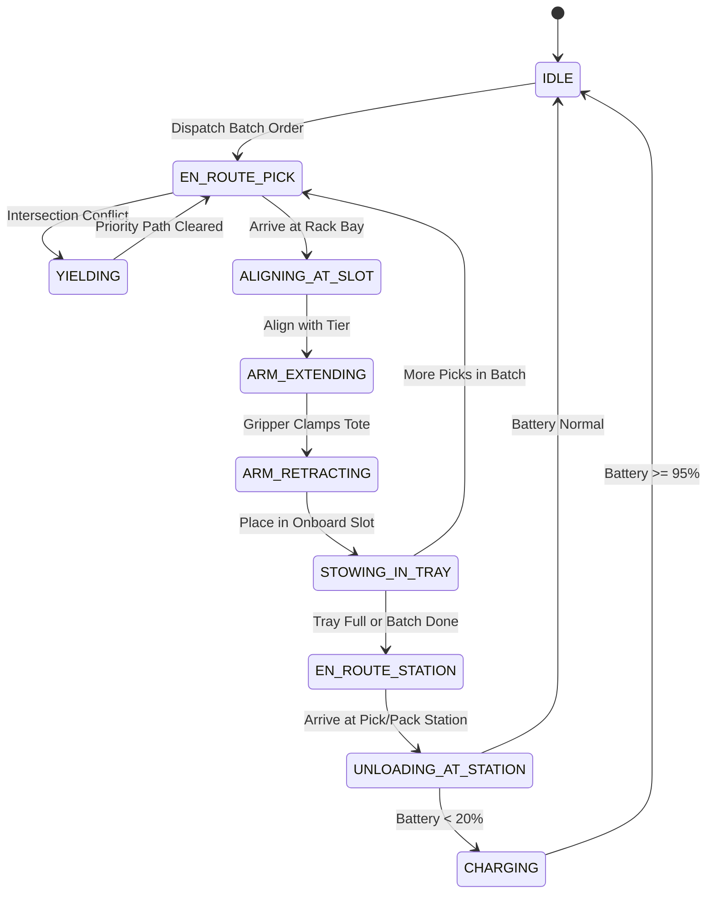
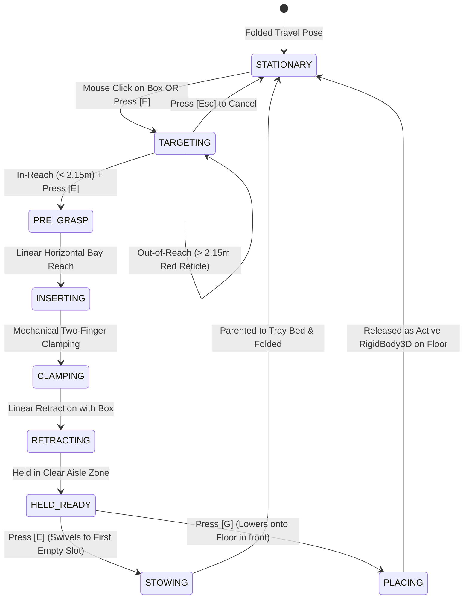
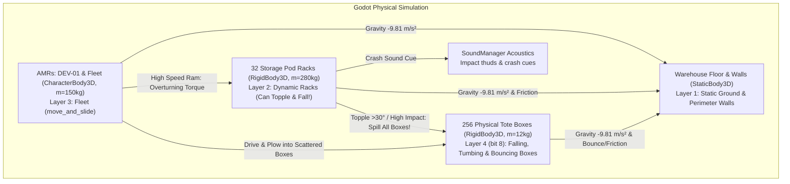

# 04_WAREHOUSE_SIMULATION_ENVIRONMENT.md — Smart Warehouse Mobile Manipulator Simulation Specification

- **Motivation/Background**: Moving beyond illustrative frontend animations ("vibe code") requires a physically grounded, mathematically deterministic warehouse simulation engine. Modern automated fulfillment centers deploy Autonomous Mobile Manipulators (AMRs with robotic picking hands) that retrieve individual SKU tote boxes from 4-tier racking and transport multi-tote batches to pick stations.
- **Purpose**: Specify the complete architectural blueprint, spatial topology, mobile manipulator kinematics, time-space reservation anti-deadlock mechanics, discrete inventory system, and Godot 3D visualization contracts.
- **Overview Pipeline**: Python backend (`src/warehouse/`) computes the ground truth graph physics, reservation table, inventory WMS, and kinematic stepping, while Godot 4 renders the 3D Digital Twin and 2D radar over VDA 5050.
- **Detailed Plan**: §1 Scope & Agreed Architectural Decisions; §2 Input & Output Contracts; §3 Mobile Manipulator Kinematics & Arm Picking Mechanics; §4 Time-Space Anti-Deadlock Engine; §5 Discrete Inventory & Fulfillment Lifecycle; §6 Godot 3D Synchronization & Visual Controls.
- **References**: `docs/PURPOSE.md`, `docs/DREAM/DREAM.md`, `agents/templates/PHASE_DOC_TEMPLATE.md`, `agents/rules/FOLDER_STRUCTURE.md`.
- **Created**: 2026-09-15T07:57:00+07:00
- **Last Updated**: 2026-09-15T09:53:00+07:00

---

## Metadata

- **Phase ID**: `PHASE-04`
- **Phase Name**: `Autonomous Mobile Manipulator Warehouse Simulation Engine & Mechanics`
- **Status**: In Progress
- **Target Modules**: [`src/warehouse/`](../../src/warehouse), [`godot/scripts/`](../../godot/scripts), [`src/utils/warehouse_bridge.py`](../../src/utils/warehouse_bridge.py)

---

## 1. Scope & Core Architectural Decisions

Following the `/grill-me` architectural design review, the simulation mechanics are locked as follows:

1. **Decoupled Architecture**:
   - **Python Core Engine (`src/warehouse/`)**: Runs ground-truth discrete-event simulation, directed grid graph, differential-drive kinematics, time-space conflict reservations, and WMS inventory tracking. Capable of fast-stepping (>1,000 steps/s) or real-time 1x clock synchronization.
   - **Godot 4 Digital Twin (`godot/`)**: High-fidelity 3D client rendering vehicle meshes, animated robotic arms, 2D Zoned Radar, and interactive operator controls via VDA 5050 WebSocket (`ws://127.0.0.1:9090`).
2. **Small Tote Boxes as the Smallest Transport Unit**:
   - The warehouse racking is stationary (4 tiers per bay).
   - The smallest transport unit is an individual **SKU Tote Box** (colored bins: Cyan=FMCG, Green=Tech, Purple=Pharma, Orange=Bulky).
3. **Mobile Manipulator Robot (MoMa)**:
   - Differential-drive mobile base with 360° LED ring.
   - Onboard payload tray capable of carrying **2 to 4 boxes** per run (enabling multi-pick batch routing).
   - Articulated **Robotic Arm / Picking Hands**:
     - **Vertical Lift (Up/Down)**: Traverses between Tiers 1 through 4 ($h = 0.4\,\text{m}$ to $2.2\,\text{m}$).
     - **Lateral Extension (Left/Right)**: Extends into shelf bays on either side of the aisle.
     - **Gripper Hands**: Pulls the target tote out and places it into the robot's onboard tray.
4. **Time-Space Anti-Deadlock Coordination**:
   - Directed grid graph ($1.2\,\text{m}$ node spacing).
   - Time-Space Reservation Table claiming `(node, [t_enter, t_exit])` and `(edge, [t_enter, t_exit])`.
   - Deterministic priority yielding at 4-way intersections with stop-bar holding (LED turns Yellow).
5. **Discrete WMS Coordinate System**:
   - Every box slot is indexed: `(Zone, Rack, Tier [1-4], Slot [1-4])`.
   - Picked slots become `EMPTY` and are re-filled during Inbound PO receiving cycles.
6. **Ergonomics & Camera**:
   - Real-time physical scale (1x) with HUD time-scale multipliers ($1\times, 2\times, 5\times$, Pause).
   - Tactical RTS overview presets (`1`–`4`) + interactive click-to-follow 3rd-person AMR camera with automatic close-up zoom during arm picking.

---

## 2. Input & Output Contracts

### Inputs
- **Facility Grid Definition**: Racking aisles, node coordinates, directed one-way/two-way highway rules, dock coordinates, and charging pads.
- **WMS Order Manifests**:
  - Outbound Sales Orders (`SO-xxx`): Target SKU, required quantity, target Pick Station.
  - Inbound Purchase Orders (`PO-xxx`): Incoming SKU, quantity, arrival dock.

### Outputs (VDA 5050 State Snapshot)
```json
{
  "vda5050_topic": "vda5050/v2/warehouse/state",
  "sim_time": 124.5,
  "time_scale": 1.0,
  "kpis": {
    "pick_rate_picks_per_hour": 340.0,
    "pick_rate_boost_pct": 22.5,
    "deadlocks": 0,
    "deadheading_ratio": 13.8,
    "active_fleet_count": 4
  },
  "inventory": {
    "total_slots": 128,
    "occupied_slots": 112,
    "empty_slots": 16
  },
  "fleet": {
    "AMR-01": {
      "x": -18.2,
      "z": 4.8,
      "heading_deg": 90.0,
      "velocity": 1.2,
      "state": "PICKING",
      "battery": 94.5,
      "carried_totes": [
        {"sku": "FMCG Beverage", "color": "#00e5ff", "slot_idx": 0},
        {"sku": "Tech Hardware", "color": "#1aff70", "slot_idx": 1}
      ],
      "arm": {
        "tier": 2,
        "side": "LEFT",
        "extension_pct": 0.85,
        "action": "RETRACTING"
      }
    }
  }
}
```

---

## 3. Execution Pipeline & Mechanics Engine

```text
WMS Orders (Inbound / Outbound)
              │
              ▼
   Task & Batch Allocator ──► Assigns 2-4 pick targets to nearest AMR
              │
              ▼
Time-Space A* / Conflict Router ──► Reserves [t_enter, t_exit] on nodes/edges
              │
              ▼
   Kinematic Stepper (dt = 0.05s)
   ├─ In-place rotation (omega = 120 deg/s)
   ├─ Linear acceleration (a = 1.0 m/s^2, v_max = 1.5 m/s)
   ├─ Arm vertical lift & lateral reach (t_pick = 2.5s)
   └─ Station dwell & unload (t_unload = 1.5s/box)
              │
              ▼
   VDA 5050 WebSocket Publisher ──► Godot 4 3D Digital Twin Client
```

---

## 4. Technical Specifications

### 4.1 Mobile Manipulator Physical Model
- **Base Footprint**: $0.9\,\text{m} \times 0.7\,\text{m} \times 0.35\,\text{m}$.
- **Drive System**: Differential non-holonomic drive (turns in place about center of axle).
- **Onboard Tray**: 4 partitioned bays ($2 \times 2$ matrix) on the rear deck holding standard $400 \times 300\,\text{mm}$ plastic totes.
- **Vertical Mast**: Centrally mounted linear actuator column ($z = 0.4\,\text{m}$ to $2.2\,\text{m}$).
- **Articulated Hand**: Telescopic horizontal slide ($0.8\,\text{m}$ reach) with pneumatic/clamp gripper.

### 4.2 State Machine


### 4.3 Developer Manual Bot (`DEV-01`) Dynamic Robotic Arm & 3D IK Mechanics

For manual environment testing and physical validation, `DEV-01` features a continuous 4-DOF dynamic robotic arm on a pedestal mast with analytical 3D Inverse Kinematics, parallel mechanical clamping fingers, dual-slot physical cargo tray with `Area3D` payload sensors, and interactive targeting:



- **Interactive Operator Controls**:
  - `Mouse Left Click`: Casts 3D raycast from viewport camera to select any `ToteBox` (on rack shelf or floor).
  - `[E] Key`: Targets nearest box (if none selected) and triggers 3-stage dynamic pick; if holding box, stows to first available cargo tray slot.
  - `[G] Key`: Dynamically places held box onto the floor in front of the robot.
  - `[Esc] Key`: Quick-cancels active targeting/pick state and smoothly returns the arm to compact resting pose.
  - `Compact Folded Rest Pose & Idle Breathing`: When inactive, the arm folds down low along the chassis deck ($Y_{\max} \approx 1.03\,\text{m}$, shoulder $-68^\circ$, elbow $140^\circ$, wrist $-72^\circ$, neatly closed fingers). Implements organic $0.24\,\text{Hz}$ hydraulic breathing sway and chassis inertial suspension compliance.
  - `Targeting Reticle`: Real-time holographic ring (Cyan when in reach $\le 2.15\,\text{m}$, Red when out of reach). Target distance is measured strictly from the shoulder joint.
  - `Extended Reach Envelope`: $L_1 = 1.02\,\text{m}, L_2 = 0.86\,\text{m}, L_3 = 0.25\,\text{m}, R_{max} = 2.15\,\text{m}$, mounted on a $0.2\,\text{m}$ pedestal mast ($Y = 0.56\,\text{m}$ world shoulder height) to reach all 4 rack tiers ($h = 0.56, 1.11, 1.67, 2.23\,\text{m}$).
  - `Dual-Slot Physical Tray with Dynamic Compliance & Sensors`: Slot 1 (Front $Z = -0.22$) and Slot 2 (Rear $Z = +0.22$) equipped with physical `Area3D` sensors. Stowed boxes exhibit realistic inertial compliance (sliding $\pm 1.8\,\text{cm}$, pitching $\pm 2^\circ$, and vibrating with road travel) rather than remaining frozen solid. On high-speed impacts ($v > 1.9\,\text{m/s}$), boxes realistically tumble forward onto the floor carrying forward momentum under gravity.
  - See [`DYNAMIC_ROBOTIC_ARM_DESIGN_DECISIONS.md`](../references/DYNAMIC_ROBOTIC_ARM_DESIGN_DECISIONS.md) for architectural trade-off evaluations.
### 4.3 Audio Design & Sound Effects Mapping

To provide tactile, responsive operator feedback without project bloat (<300 KB total), an audio layer is configured via [`SoundManager`](../../godot/scripts/utils/sound_manager.gd):

| Event | Bus / Space | Asset Source | File |
| :--- | :--- | :--- | :--- |
| **Button Click / Spawn** | 2D UI | `MenuSFX/OGG/Abstract` | `res://audio/ui/click.ogg` |
| **Reset / Cancel** | 2D UI | `MenuSFX/OGG/Abstract` | `res://audio/ui/cancel.ogg` |
| **Camera / Fullscreen Toggle** | 2D UI | `MenuSFX/OGG/Abstract` | `res://audio/ui/toggle.ogg` |
| **Arm Prepare Swivel** | 3D Spatial | `MenuSFX/OGG/Abstract` | `res://audio/sfx/arm_prepare.ogg` |
| **Rack Tier Select (1..4)** | 3D Spatial | `MenuSFX/OGG/Abstract` | `res://audio/sfx/tier_select.ogg` *(rising pitch $0.85 \rightarrow 1.33$)* |
| **Box Grasp / Pick Latch** | 3D Spatial | `MenuSFX/OGG/Abstract` | `res://audio/sfx/box_pick.ogg` |
| **Box Stow to Cargo Tray** | 3D Spatial | `MenuSFX/OGG/Abstract` | `res://audio/sfx/box_stow.ogg` |
| **Hydraulic Brake / Impact** | 3D Spatial | `SweetSounds_SFX/WAV` | `res://audio/sfx/brake.wav` |

---

### 4.5 Physical Collision Architecture, Dynamic Boxes & Environment Reset

In the **Environment Building Sector**, all physical entities are simulated in full 3D rigid-body and kinematic collision physics:



- **Collision Layers & Masks**:
  - **Layer 1 (`Environment_Static`)**: Ground floor ($140 \times 100\,\text{m}$) and 4 boundary perimeter walls. Supports downward gravity $\vec{g} = (0, -9.81, 0)\,\text{m/s}^2$.
  - **Layer 2 (`Racks_Dynamic`)**: 32 storage pods built as **hollow compound rigid bodies** (`RigidBody3D`, $m = 280\,\text{kg}$) with 4 corner post colliders and 4 horizontal shelf divider plates, leaving real open physical space between tiers.
  - **Layer 4 (`AMR_Fleet`)**: AMRs configured as **`CharacterBody3D` with `move_and_slide()`**. Bumper collisions transfer kinetic impulse to `RigidBody3D` colliders and trigger crash SFX.
  - **Layer 8 (`Tote_Boxes`)**: 256 live physical **`ToteBox` (`RigidBody3D`, $m = 12\,\text{kg}$)** nodes. They are **100% dynamic physics objects at all times (`freeze = false`)** resting directly on top of the physical shelf plates under real gravity. When an AMR rams a rack hard enough to tip it over, the shelf plates tilt, and the boxes slide off the shelves and crash to the floor completely through natural Godot physics!
  - **AMR Box Plowing**: When `DEV-01` drives into scattered boxes on the floor, the kinematic collision loop transfers momentum, plowing, nudging, and kicking boxes across the warehouse.

- **Full Environment Reset Standard (`R` Key & HUD Reset Button)**:
  - Triggering `_reset_entire_environment()`:
    1. **All 32 Storage Racks**: Restored to their exact initial positions and upright transforms using `PhysicsServer3D.body_set_state` and `_integrate_forces`, zeroing linear and angular velocities, clearing the toppled status, and restoring zone labels.
    2. **All 256 Tote Boxes**: Teleported back onto their assigned shelf plates with zeroed velocities, ready to rest naturally under gravity.
    3. **All AMRs (`DEV-01` & Fleet)**: Reset to initial berths with zero velocity, folded arm pose, cleared cargo tray, and restored HUD telemetry.
    4. **Manifests**: Inbound and Outbound orders reset to `PENDING`.

### 4.6 RL Observation, Action & Reward Foundations

- **Observation Space $\mathbf{o}_t \in \mathbb{R}^{24}$**:
  - 16-beam normalized LiDAR distances $d_i \in [0, 1]$.
  - Chassis forward velocity $v$ and yaw rate $\omega$.
  - Relative target vector $(\Delta x_{goal}, \Delta z_{goal}, \Delta \theta_{goal})$.
  - Onboard tote count $N_{totes} \in [0, 4]$.
  - Collision bumper contact flag $\in \{0, 1\}$.
  - Lateral acceleration $a_{lateral}$.
- **Reward Formulation**:
  $$R_t = R_{progress} + R_{pick\_stow} - P_{collision} - P_{instability} - P_{time}$$
  - $R_{progress} = c_{prog} \cdot (d_{t-1} - d_t)$ (potential-based shaping).
  - $R_{pick\_stow} = +50.0$ per successfully stowed tote box.
  - $P_{collision} = -30.0 - 10.0 \cdot \|\vec{v}_{impact}\|$ (severe penalty for hitting obstacles).
  - $P_{instability} = -2.0 \cdot \max(0, |a_{lateral}| - 2.5)^2$ (penalizes load-tipping maneuvers).
  - $P_{time} = -0.02$ per timestep (encourages efficient throughput).

---

## 5. Verification & Implementation Phases

1. **Step 1 (`src/warehouse/core/`)** — Completed:
   - Implemented `grid_map.py`: Discrete directed graph, node types, aisle coordinates.
   - Implemented `inventory_manager.py`: Discrete rack slots, SKU categories, occupancy tracking.
2. **Step 2 (`src/warehouse/simulation/`)** — In Progress:
   - Implement `collision_detector.py`: Vectorized Separating Axis Theorem (SAT) OBB and LiDAR raycasting for headless Python training.
   - Implement `reservation_table.py`: Time-space conflict resolver with priority yielding.
   - Implement `amr_kinematics.py`: Differential drive kinematics, arm pick/stow sequences, battery model.
3. **Step 3 (`godot/`)** — Completed:
   - Redesigned `amr_robot.tscn`: Mobile Manipulator chassis matching reference design, articulated 3-joint picking arm, rear cargo tray.
   - Implemented interactive Developer Manual Bot arm state machine (`E` prepare $\rightarrow$ `1-4` tier $\rightarrow$ `F` pick $\rightarrow$ `E` stow/fold).
   - Integrated lightweight curated audio SFX library (<300 KB) and `SoundManager`.
4. **Step 4 (`godot/` & `src/warehouse/`) — Physical Collisions & Gravity**:
   - Upgrade `warehouse_floor.tscn` and `shelf_pod.tscn` with `StaticBody3D` colliders.
   - Upgrade `amr_robot.tscn` to `CharacterBody3D` with `move_and_slide()` gravity and bumper recoil.
   - Attach 16-ray `RayCast3D` virtual LiDAR ring to AMR chassis.
   - Verify headless Python collision parity with Godot 3D physics.

