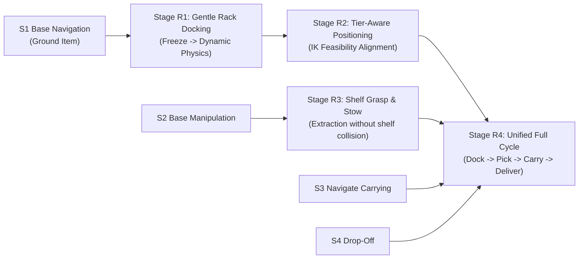

# Multi-Shot Rack Training Specification (Phase 07)

## 1. Executive Summary

This document specifies the architecture, environment dynamics, observation/action interfaces, and curriculum stages for training Autonomous Mobile Manipulators (AMRs) to dock, target, grasp, and deliver tote boxes stored across multi-tier physical warehouse racks.

Training follows a **Python-First Reinforcement Learning** paradigm using Stable-Baselines3 (PPO) and Gymnasium over a high-throughput lockstep TCP bridge to Godot 4. Post-graduation, trained network weights are exported via `export_policy_to_godot.py` into Godot-compatible JSON format for zero-latency, in-engine inference via `NeuralPolicy`.

---

## 2. Physical Rack & Box Mechanics

### 2.1 Rack Geometry (`ShelfPod`)
- **Class**: `ShelfPod` extends `RigidBody3D`
- **Tiers**: 4 vertical storage levels
  - Tier 1: $Y = 0.56\text{ m}$ (ground-accessible)
  - Tier 2: $Y = 1.11\text{ m}$ (mid-low shelf)
  - Tier 3: $Y = 1.67\text{ m}$ (mid-high shelf)
  - Tier 4: $Y = 2.23\text{ m}$ (high shelf)
- **Slots**: 2 bays per tier:
  - Left Slot: $X = -0.36\text{ m}$ relative to rack center
  - Right Slot: $X = +0.36\text{ m}$ relative to rack center
- **Capacity**: 8 physical `ToteBox`es per rack.
- **Topple Mechanics**:
  - `up_alignment = basis.y.dot(Vector3.UP)`
  - Deflection $> 15^\circ$ triggers angular instability.
  - Deflection $> 49^\circ$ (`up_alignment < 0.65`) marks the rack as **TOPPLED**, scattering boxes across the floor.
  - Toppling terminates the episode with a heavy penalty ($-10.0$).

### 2.2 Tote Box Dynamics (`ToteBox`)
- **Class**: `ToteBox` extends `RigidBody3D`
- Rests physically on hollow shelf plates under gravity.
- Slides off shelves if the rack tilts significantly or upon violent external impact.
- Dynamic visual highlighting is activated on the active target box per episode.

---

## 3. Observation & Action Space (16-D Observation, 3-D Action)

### 3.1 Observation Vector (16 Dimensions)

| Index | Feature | Range | Description |
| :---: | :--- | :---: | :--- |
| **0** | Normalized Robot X | $[-1.0, 1.0]$ | $X / 8.0\text{ m}$ (arena coordinate) |
| **1** | Normalized Robot Z | $[-1.0, 1.0]$ | $Z / 8.0\text{ m}$ (arena coordinate) |
| **2** | Heading Sine | $[-1.0, 1.0]$ | $\sin(\text{yaw})$ |
| **3** | Heading Cosine | $[-1.0, 1.0]$ | $\cos(\text{yaw})$ |
| **4** | Normalized Linear Velocity | $[-1.0, 1.0]$ | $v_{\text{lin}} / 2.8\text{ m/s}$ |
| **5** | Normalized Angular Velocity | $[-1.0, 1.0]$ | $\omega / 2.2\text{ rad/s}$ |
| **6** | Sub-Goal Local $\Delta X$ | $[-1.0, 1.0]$ | Local lateral offset to target box $/ 16.0\text{ m}$ |
| **7** | Sub-Goal Local $\Delta Z$ | $[-1.0, 1.0]$ | Local forward offset to target box $/ 16.0\text{ m}$ |
| **8** | Sub-Goal 3D Distance | $[0.0, 1.0]$ | Euclidean distance to target box $/ 16.0\text{ m}$ |
| **9** | Carrying Status | $\{0.0, 1.0\}$ | $1.0$ if box stowed in tray, else $0.0$ |
| **10** | Tray Status | $\{0.0, 1.0\}$ | $1.0$ if tray slot occupied, else $0.0$ |
| **11** | Nearest Arena Wall Distance | $[0.0, 1.0]$ | Distance to closest boundary wall $/ 8.0\text{ m}$ |
| **12** | Wall Margin / Reserved | $[0.0, 1.0]$ | Reserved wall proximity channel |
| **13** | **Target Tier (Normalized)** | $[0.25, 1.0]$ | $\text{tier\_idx} / 4.0$ (T1=$0.25$, T2=$0.50$, T3=$0.75$, T4=$1.0$) |
| **14** | **Target Slot Side** | $\{-1.0, +1.0\}$ | $-1.0$ for Left slot, $+1.0$ for Right slot |
| **15** | **Rack Face Alignment** | $[-1.0, 1.0]$ | $\vec{f}_{\text{robot}} \cdot \vec{n}_{\text{rack\_face}}$ (1.0 = squarely facing bay) |

### 3.2 Action Vector (3 Continuous Outputs)

| Index | Action | Range | Description |
| :---: | :--- | :---: | :--- |
| **0** | $v_{\text{lin}}$ (Linear Throttle) | $[-0.15, 1.0]$ | Scaled to $[-0.42, 2.80]\text{ m/s}$ forward/reverse |
| **1** | $v_{\text{ang}}$ (Angular Steering) | $[-1.0, 1.0]$ | Scaled to $[-2.2, 2.2]\text{ rad/s}$ turning rate |
| **2** | $a_{\text{trig}}$ (Manipulation Trigger) | $[-1.0, 1.0]$ | Arm grasp trigger (threshold $> 0.25$) |

---

## 4. Multi-Shot Rack Curriculum (R1 $\rightarrow$ R2 $\rightarrow$ R3 $\rightarrow$ R4)



### 4.1 Stage R1: Gentle Rack Navigation & Docking
- **Primary Goal**: Approach the target rack face from any starting pose and decelerate into a stable, square docking stance without toppling or ramming the rack.
- **Physics Curriculum**:
  - *Phase A ($0\% - 70\%$ success rate)*: Rack physics frozen (`freeze = true`). Agent learns spatial approach angles and heading alignment.
  - *Phase B ($> 70\%$ success rate)*: Rack unfreezes (`freeze = false`, full `RigidBody3D` dynamics). Any violent impact tilts the rack.
- **Docking Completion Gate**:
  - Distance to rack face target: $d \le 1.25\text{ m}$
  - Heading alignment: $\vec{f} \cdot \vec{n}_{\text{face}} \ge 0.85$ ($\approx \pm 30^\circ$)
  - Linear velocity: $|v_{\text{lin}}| \le 0.25\text{ m/s}$ (controlled crawl / stationary)
  - Rack stability: Tilt angle $< 5^\circ$
- **Reward Formulation**:
  $$R = R_{\text{progress}} + R_{\text{heading}} + R_{\text{dock}} - P_{\text{speed\_near}} - P_{\text{tilt}} - P_{\text{wall}} - P_{\text{step}}$$
  - $R_{\text{progress}} = (d_{t-1} - d_t) \times 3.0$
  - $R_{\text{heading}} = \max(0, \text{alignment}) \times 0.15$
  - $R_{\text{dock}} = +5.0 + (\text{alignment} \times 2.0)$ upon triggering docking gate
  - $P_{\text{speed\_near}} = 0.10 \times (v - 0.40)$ if $d \le 1.8\text{ m}$ and $v > 0.40\text{ m/s}$
  - $P_{\text{tilt}} = -10.0$ and episode termination if rack tilts $> 15^\circ$
  - $P_{\text{step}} = -0.01$

### 4.2 Stage R2: Tier-Aware Fine Positioning & Arm IK Targeting [COMPLETED]
- **Primary Goal**: Position chassis precisely so that `ArmIKSolver.solve_local()` yields a kinematically reachable solution for the specific target tier ($Y \in [0.56, 2.23]\text{ m}$) and slot ($X \in \{-0.36, 0.36\}\text{ m}$).
- **Kinematic Dynamics**:
  - Lower shelves (Tiers 1 & 2): Docking at $d \approx 2.30\text{m} - 2.36\text{m}$ satisfies reach ($IK \approx 1.95\text{m} - 2.05\text{m}$).
  - Upper shelves (Tiers 3 & 4): The policy learned to drive closer into the bay ($d \approx 1.40\text{m} - 2.10\text{m}$) because vertical height takes up reach envelope.
- **Benchmark Results (30 episodes)**:
  - **Arm IK Reachability**: **96.7%** (29/30)
  - **Docking Success**: **96.7%**
  - **Topple Rate**: **0.0%** (0/30)
  - **Native Parity**: Max deviation $1.55 \times 10^{-8}$

### 4.3 Stage R3: Shelf Grasp & Cargo Stow [NEXT]
- **Primary Goal**: Handover from R2 stance $\rightarrow$ Arm trajectory execution: extend end effector into shelf slot, clamp tote box, retract along horizontal staging axis without colliding with rack uprights, and stow safely onto the AMR's rear cargo tray.
- **Reward**: $+8.0$ on clean extraction and tray latching; $-10.0$ on topple or shelf plate collision.

### 4.4 Stage R4: Unified Full Rack-to-Dispatch Cycle
- **Primary Goal**: Single unified policy running end-to-end:
  $\text{Start} \rightarrow \text{Dock at Target Rack} \rightarrow \text{Pick Box from Assigned Tier} \rightarrow \text{Navigate Carrying} \rightarrow \text{Place in Drop Zone}$.
- **Export**: Saved as `ppo_rack_unified.zip` and exported to `godot/models/ppo_rack_policy.json`.

---

## 5. File Structure & Implementation Deliverables

```
RL_port_scheduling_container/
├── configs/
│   └── config.yaml                                <-- Centralized 200 Hz physics / 60 Hz action clocks
├── docs/
│   └── RACK_TRAINING_SPEC.md                      <-- This specification
├── godot/
│   ├── models/
│   │   ├── ppo_r1_policy.json                     <-- Stage R1 native policy
│   │   └── ppo_r2_policy.json                     <-- Stage R2 native policy (IK validated)
│   ├── scenes/
│   │   └── training/
│   │       ├── training_rack_docking.tscn         <-- Stage R1 scene
│   │       ├── training_rack_targeting.tscn       <-- Stage R2 scene
│   │       └── training_rack_cycle.tscn           <-- Stage R4 scene
│   └── scripts/
│       └── training/
│           ├── rack_docking_env.gd                <-- Stage R1 controller
│           ├── rack_targeting_env.gd              <-- Stage R2 controller
│           └── rack_cycle_env.gd                  <-- Stage R4 controller
└── src/
    ├── envs/
    │   ├── rack_docking_gym_env.py                <-- Stage R1 Gymnasium wrapper
    │   └── rack_targeting_gym_env.py              <-- Stage R2 Gymnasium wrapper
    └── training/
        ├── train_rack_r1.py                       <-- Stage R1 trainer
        ├── train_rack_r2.py                       <-- Stage R2 trainer
        └── view_policy.py                         <-- Dual-clock viewer (--stage r1, --stage r2)
```
